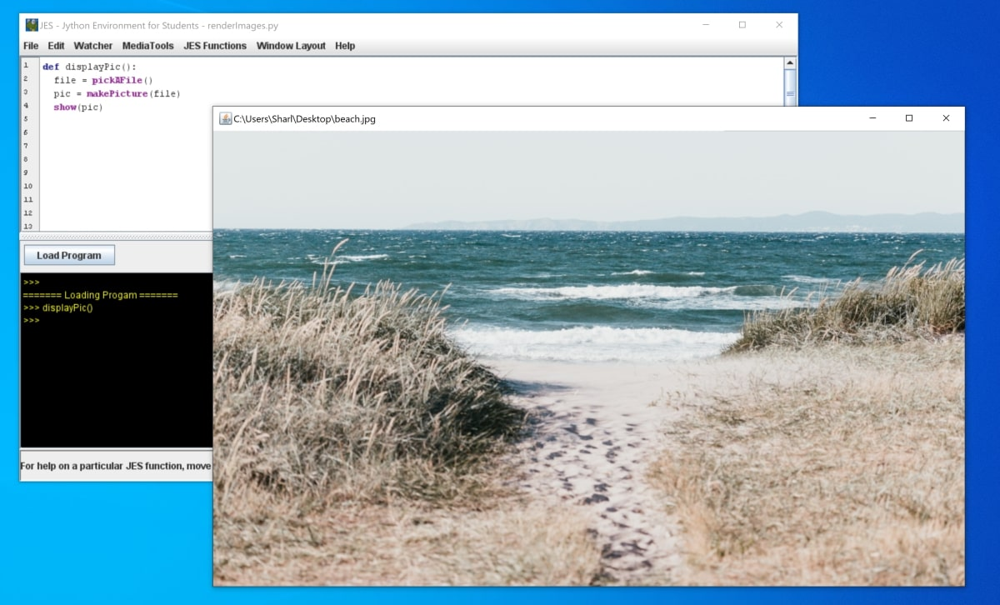

# render-images-using-JES
Examples of basic image functions you can use in JES

* Render an image
* View information about an image
* Duplicate an image
* Explore an image 

## Prerequisites 

* Make sure you have JES installed. 

## To Run

* Open the JES software on your computer
* Go to File > Open Program > 
* Select the .py file inside the renderImages folder
* Click on Load Program
* Run any function by calling it in the command line area

## Example

